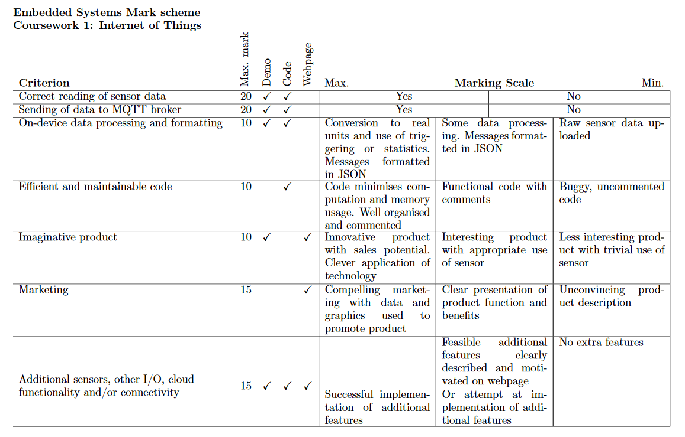
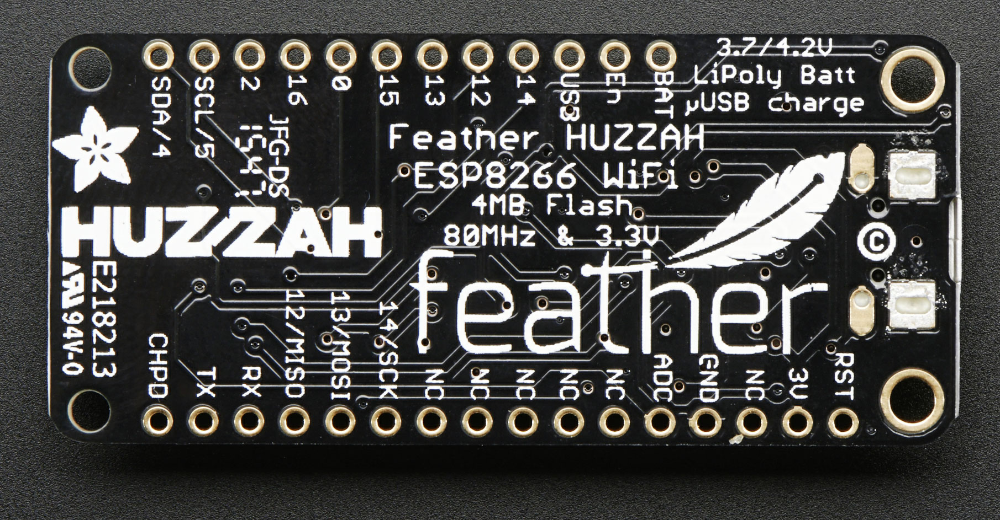

# ES_CW1
Repository for EE3-24 Embedded Systems Coursework 1


# Current List of To Dos

- [x] Figure out how to interface the embed
- [x] Figure out how to get the embed to communicate with the sensor
- [ ] Get proper raw measurements from the sensor (WIP)
- [ ] Convert raw data into a form that makes sense
- [ ] Design an IoT application for the sensor
	* Automated Light Control for light sensor
	* CLOUD ROBOTICSSSSSSS

# Scoring breakdown


# Prequisites for the coursework

## Windows Setup

Install python 2.7/3.6 for Windows, and install PuTTY in order to access the serial port.

General setup documentation can be found [here](https://learn.adafruit.com/micropython-basics-how-to-load-micropython-on-a-board/overview) 

To setup Micropython Read-Evaluate-Print Loop (REPL) can be found [here](https://learn.adafruit.com/micropython-basics-how-to-load-micropython-on-a-board/serial-terminal) 

Drivers to install for windows for ESP8226 can be found [here](https://www.silabs.com/products/mcu/Pages/USBtoUARTBridgeVCPDrivers.aspx)

Ampy failure troubleshoot can be found [here](https://forum.micropython.org/viewtopic.php?t=2702) 

In summary:
+ Python - To install relevant micropython packages
+ Serial driver - To allow PuTTY to work later on
+ PuTTY - To get a real-time output from the embed
+ ampy - File manager for the embed which can be accessed via Windows command prompt

## ESP8266 WiFi Microcontroller
Datasheet for the microcontroller can be found [here](http://download.arduino.org/products/UNOWIFI/0A-ESP8266-Datasheet-EN-v4.3.pdf). 
There is no driver implementation for the microcontroller, which might require us to implement our own code for it. 

## Windows Setup for Interfacing
General setup documentation to load Micropython into the board can be found [here](https://learn.adafruit.com/micropython-basics-how-to-load-micropython-on-a-board/overview) 

To setup Micropython Read-Evaluate-Print Loop (REPL) can be found [here](https://learn.adafruit.com/micropython-basics-how-to-load-micropython-on-a-board/serial-terminal) 

Drivers to install for windows for ESP8266 can be found [here](https://www.silabs.com/products/mcu/Pages/USBtoUARTBridgeVCPDrivers.aspx)

Ampy failure troubleshoot can be found [here](https://forum.micropython.org/viewtopic.php?t=2702) 

Instructions for installing ampy can be found [here](https://github.com/adafruit/ampy).  
The documentation for using I<sup>2</sup>C on the ESP8266 can be found [here](http://docs.micropython.org/en/latest/esp8266/library/machine.I2C.html). 

### Test script to check if setup successful:
```python 
import machine, time 
led = machine.Pin(0,machine.Pin.OUT)
while True:
	led.high()
	time.sleep(1.0)
	led.low() 
	time.sleep(1.0)
```

## I<sup>2</sup>C Interface
Refer to lecture 2 slides for specifics details of the interface. 
Most importantly, ensure that SCLK and SDA pins are connected correctly onto the mbed. 

### How to use I<sup>2</sup>C in MicroPython

After ensuring that the device is properly connected, a device can be instantiated using the following code (using VCNL4010 as an example):

```python
import machine

i2c = machine.I2C(scl = machine.Pin(5), sda = machine.Pin(4), freq = 100000)
```

This creates an I<sup>2</sup>C object for the device to handle the pins.
Every device has a specific device address that needs to be used to access its memory registers.
This can be found from the datasheet of the device of interest, but if that is not possible the following code can be used to determine the address(es):
```python
print i2c.scan() # Outputs [19] when the VCNL4010 is connected
```

For most intents and purposes, we would want to be able to read from/write to the device's memory registers.
For the VCNL4010, the registers are 0x80 to 0x90. 
The exact details the function of each register can be found in the datasheet.

### Writing data to the device
In order to write a 1 byte data to the device, we first have to encode the data into a byte type.

```python
# For VCNL4010, the device address is 0x13
# We intend to write a 1 byte value of 0xff into the memory register at address 0x80
buffer = str(0xff).encode()			# Encode the value into a byte type first			 
i2c.writeto_mem(0x13, 0x80, buffer)	# args passed as (device_add, mem_add, value)
```

### Reading data from the device
In order to read the data, we have to use a different method. 
Once again we would be using the VCNL4010 as an example, where we are attempting to obtain the light and proximity readings. 

```python
# Data memory registers are located from 0x85 to 0x88

# args passed as (device_add, starting_mem_add, no_of_bytes_read)
# 4 so that it reads 4 bytes starting from 085, ending at 0x88
raw_bytes = i2c.readfrom_mem(0x13, 0x85 ,4) 

# We need to convert this array of bytes into and array of int values by doing so
converted_bytes = bytearray(raw_bytes) 

# converted_bytes currently has 4 elements, [0] -> 0x85, [1]-> 0x86, [2] -> 0x87, [3] -> 0x88
```

Once we have converted the raw data into integer values, we can perform further processing in order to make sense of the data. 
Refer to VCNL4010.py or to the datasheet on how to perform this. 

# Architecture

## Embed 
Adafruit Feather HUZZAH ESP8266 PINOUT Diagram


## Designated Sensor

A Sensor class for the Light and Proximity Sensor was created in vcnl4010.py, that is able to convert the reading from the sensor into a raw integer value.
More applications of the VCNL4010 sensor can be found [here](http://www.vishay.com/docs/84138/designingvcnl4010.pdf).


## Interaction with server via WiFis using MQTT
The documentation for MQTT using MicroPython can be found [here](https://github.com/micropython/micropython-lib/tree/master/umqtt.simple). 

MQTT is a message-passing library that uses a publisher-subscriber framework, through a common broker server. 
Each message can be labelled with a specific topic, which describes the type of messages being passed.
[MQTT](https://github.com/micropython/micropython-lib/tree/master/umqtt.simple) is already available as a library of MicroPython, which can be used by doing `from umqtt.simple import MQTTClient`. 

We would also need to install an MQTT implementation on our machines in order to subscribe to the topic. 
We would be using [Paho](https://pypi.python.org/pypi/paho-mqtt/1.1#single, which is a desktop implementation of MQTT.
Install it by running the following code:

```bash
python pip install paho-mqtt
```

The MQTT code has been written under `publisher.py` and `subscriber.py`, which should be run on the embed and your machine respectively.
An `MQTTWrapper` class has also been written for the embed under `publisher.py`, which handles the topic and connection with the MQTT broker.
The following sections describes how the embed and laptops are programmed in order to achieve message passing.


### Establishing an Internet Connection
First, we have to manually configure our embed to connect with the WiFi.
We do not have to do this on our laptops as we should be automatically connected to the internet.

```python
import network

# This stops other machines from connecting to us
ap_if = network.WLAN(network.AP_IF)
ap_if.active(False)

# This allows us to connect to the router
sta_if = network.WLAN(network.STA_IF)
sta_if.active(True)
sta_if.connect('<essid>','<password>') # EEERover, exhibition for our labs
``` 
### MQTT Client
For the publisher, `on_connect()` and `on_disconnect()` functions are required to be defined in the script.
While for the subscriber, `on_connect()`, `on_disconnect()` and `on_message()` functions are required to be defined in the script. 
These functions would be used as for callbacks, which would be activated when a certain event happens e.g. `on_connect()` would be called upon successfully connecting the embed to the broker and so on.
All data processing on incoming messages should be written under `on_message()`.
#### Publisher
Refer to `publisher.py` for the exact implementation of the code.
The basic setup for the publisher is as such:

```python
def on_connect(client, userdata, flags, rc):
		print("Connection returned result: " + str(rc))

def on_disconnect(client, userdata, rc):
    if rc != 0:
        print("Unexpected disconnection.")

...

client = MQTTClient(machine.unique_id(), broker_ip_add) # broker_ip_add for our lab is "192.168.0.10"

client.on_connect = on_connect
client.on_disconnect = on_disconnect
client.connect()

```

After successfully setting up the publisher, it can publish data onto the broker as such:
```python
buffer = str(data).encode('utf-8') # This encodes the data into a byte array, using utf-8 encoding

client.publish("<your_mom's_topic>", buffer)
```

#### Subscriber
Refer to `subscriber.py` for the exact implementation of the code.
The main thing to note is that `client.loop()` is called as a polling loop in order to detect for any incoming messages from the broker.
